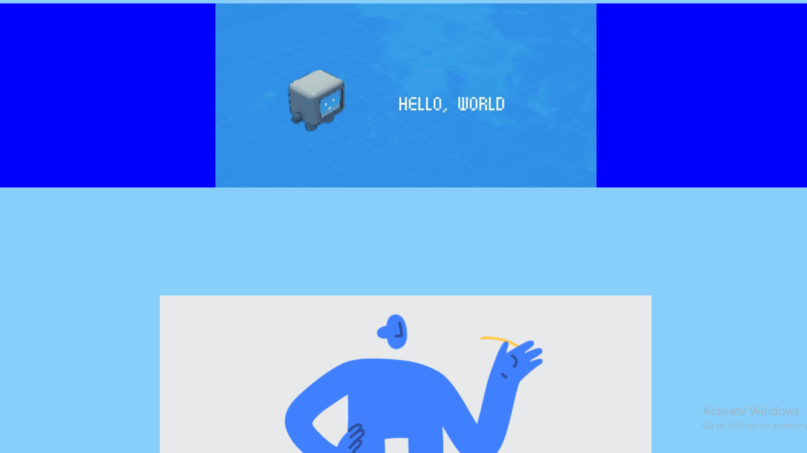

# Hello World

***I used Sololearn to learn how to print Hello World in the different programming languages.***

## Printed "Hello World!" Using the following programming languages:

* C sharp (C#)

* C plus plus (C++)

* JAVA

* PHP

* Python

* R

* Ruby

* WEB :-
1. HTML
2. CSS
3. JavaScript

